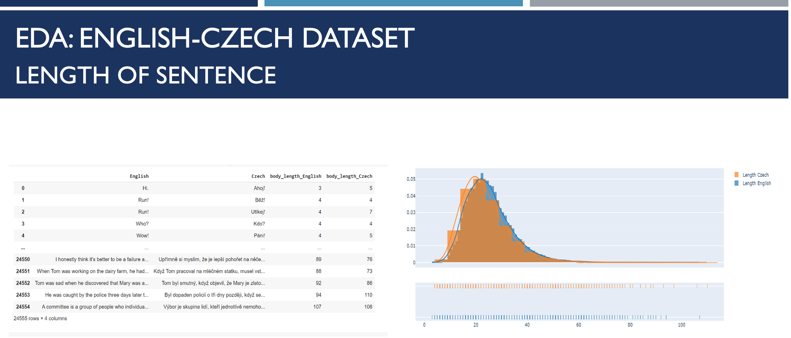
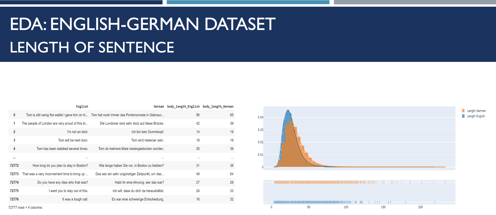
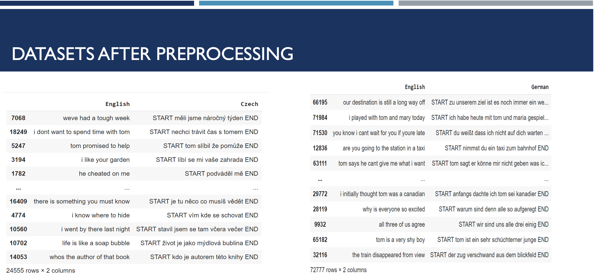
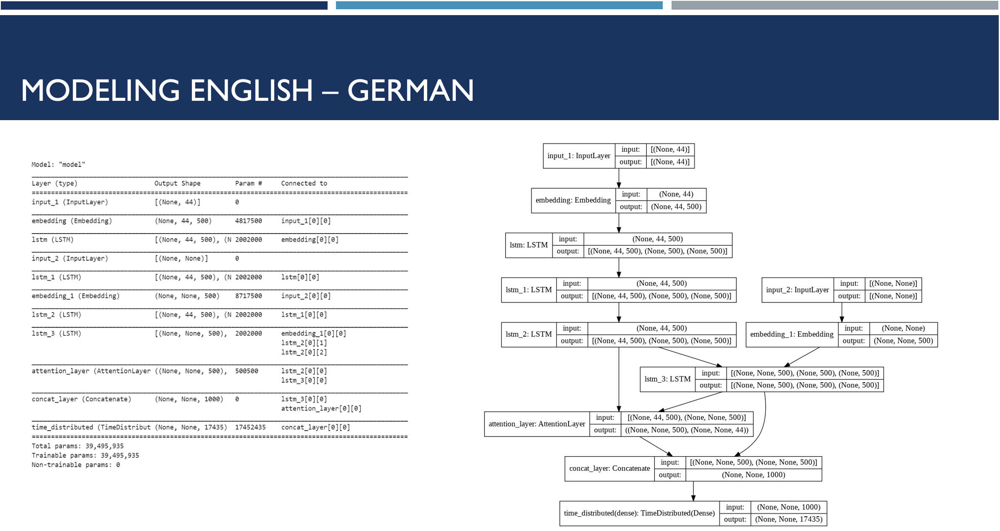
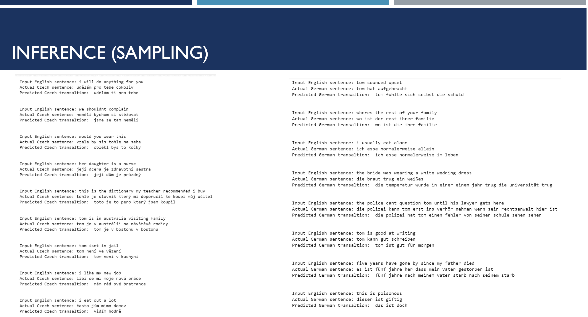
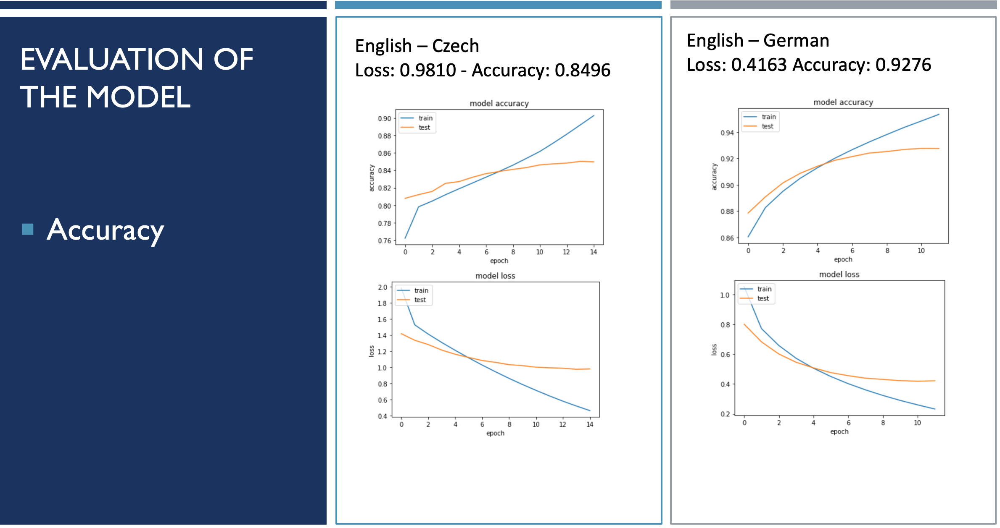

# Neural Machine Translation

Neural Machine Translation (NMT) for language pairs English – Czech, and English – German using Sequence-to-Sequence Learning. 
Sequence-to-sequence learning is about training models to convert sequences from one domain (sentences in English) to sequences in another domain (the same sentences translated to Czech/German). We will be training a sequence-to-sequence model based on two Long Short-Term Memory (LSTM) layers to translate English sentences to Czech and German. We will be using LSTM because Recurrent Neural Networks suffer from short-term memory. If a sequence is long enough, it will have a hard time carrying information from earlier time steps to later ones, and our model might give us wrong translation. During back propagation, recurrent neural networks suffer from the vanishing gradient problem. In RNT layers that get a small gradient update stops learning, and because these layers do not learn, RNN’s can forget what it seen in longer sequences. That is why we decided to use LSTM, because it has gates that can regulate the flow of information. These gates can learn which data in a sequence is important to keep or throw away. By doing that, it can pass relevant information down the long chain of sequences to make predictions
## Exploratory Data Analysis:

## Preprocessing: 
For the English – Czech, and English – German language pairs, we applied series of preprocessing steps:
-	Splitting the loaded text by line
-	Converting words to lower case
-	Removing quotation marks and digits
-	Removing punctuation
-	Normalizing punctuation
-	Appending ‘start’ and ‘end’ tags to the target sentence
-	Tokenization and padding

## Modeling: 
The model uses the encoder that reads a variable length input sequence, and hidden state and the cell state of the encoder passes as input to the decoder along with the actual target sequences. The Embedding layer converts each word to a vector. The model uses the decoder that predicts a variable length output sequence. Both the encoder and decoder have the embedding layer (first hidden layer) which translate large sparse vectors into a dense lower-dimension space preventing the semantic relationship. 
The LSTM layer is defined to both return sequences and state. The Dense output layer is used to predict each character. The decoder output is passed through the softmax layer that learns to classify the correct target character. The loss function is categorical cross entropy that is obtained by comparing the predicted values from softmax layer with the target. Also, we used Bahdanau Attention Mechanism because it is difficult for the decoder to summarize large input sequence at once. The Attention Layer extracts useful information from the encoder and transmits it back to the decoder. Attention places different focus on different words by assigning each word with a score. Then, using the softmaxed scores, we aggregate the encoder hidden states using a weighted sum of the encoder hidden states, to get the context vector, and then we feed the context vector into the decoder. Finally, the model is defined with inputs for the encoder and the decoder and the output target sequence. For the model training step, we used Early Stopping Trigger because when we are training a large network, there will be a point during training when the model will stop generalizing and start learning the statistical noise in the training dataset. Too little training will mean that the model will underfit the train and the test sets. Too much training will mean that the model will overfit the training dataset and have poor performance on the test set. To solve this problem, we used EarlyStopping.  During training, the model is evaluated on a holdout validation dataset after each epoch. If the performance of the model on the validation dataset starts to degrade (loss begins to increase or accuracy begins to decrease), then the training process is stopped.

## Inference (sampling): created the inference model using the trained model for making predictions.

## Evaluation of the model: 
-	Accuracy: The performance of the baseline model was tested using accuracy, which measures how close predicted values and actual values are to each other.  In this case, the values are words or sequences of words, and the distinction between actual and predicted values is represented as a percent.

-	BLEU Score: The performance of the baseline model was tested using the BLEU (Bilingual Evaluation Understudy) Score, which ranges between 0 and 1. The BLEU score is evaluated by counting the number of matches between the candidate n-grams and the reference translation n-grams. The BLEU score metric is applicable for this model as it compares texts or sentences within the context of the two pairs of languages. Additionally, the wide adoption within NLP models and language independence of the metric were additional factors to select this metric.  We used BLEU score without weights, and BLEU score with Cumulative score (refers to the calculation of individual n-gram scores at all orders from 1 to n and weighting them by calculating the weighted geometric mean).

- Limitations of BLUE Score: It does not consider meaning. It only rewards system for n-grams that have exact matches in the refence system. That means that a difference in a function word is penalized as heavily as a difference in a more important content word. Even if a translation has a perfectly valid synonym, it will be penalized.
